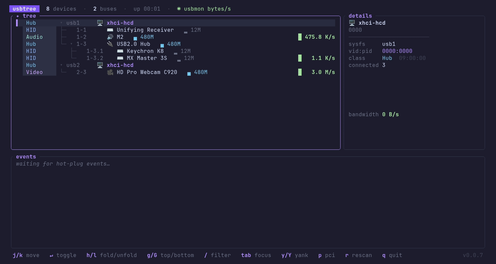

# usbtree

Cross-platform TUI for inspecting the USB device tree (Linux, macOS, Windows). Enumerates via [nusb](https://crates.io/crates/nusb) — pure Rust, no root, no libusb. One static binary, zero runtime deps: **~1.5 MB download, ~5–7 MB on disk**.


[](LICENSE)
[](https://github.com/gnomeria/usbtree/actions/workflows/ci.yml)
[](https://github.com/gnomeria/usbtree/releases/latest)

**Website:** [gnomeria.github.io/usbtree](https://gnomeria.github.io/usbtree)



## Platform support

| Feature                                              |     Linux     | macOS | Windows |
| ---------------------------------------------------- | :-----------: | :---: | :-----: |
| Device tree — hubs, classes, speeds, tree rails      |      ✅       |  ✅   |   ✅    |
| Friendly names (`overrides.ids` + usb.ids)           |      ✅       |  ✅   |   ✅    |
| Hot-plug watch + timestamped event log               |      ✅       |  ✅   |   ✅    |
| Detail panel — sysfs path, vid:pid, serial, children |      ✅       |  ✅   |   ✅    |
| Device power — advertised `bMaxPower`                |      ✅       |  ✅   |    —    |
| Live activity sparklines — URBs/s (unprivileged)     |      ✅       |   —   |    —    |
| Real bandwidth — bytes/s via usbmon (root)           |      ✅       |   —   |    —    |
| Prebuilt binaries                                    | amd64 · arm64 | arm64 |  amd64  |

Live per-device activity is Linux-only — [why →](#activity-metrics-linux).

## Install

> [!NOTE]
> The shell installer and prebuilt links need a published GitHub release. None yet? Install from source.

**Linux / macOS**

```sh
curl -fsSL https://raw.githubusercontent.com/gnomeria/usbtree/main/scripts/install.sh | sh
```

**Windows**

```powershell
irm https://raw.githubusercontent.com/gnomeria/usbtree/main/scripts/install.ps1 | iex
```

**From source**

```sh
cargo install --git https://github.com/gnomeria/usbtree
```

Installers verify the archive's sha256 against `checksums.txt` and install to `/usr/local/bin` or `~/.local/bin` (Linux/macOS) / `%LOCALAPPDATA%\usbtree\bin` + user `PATH` (Windows). Env vars (prefix `$env:` in PowerShell):

| Variable               | Effect                                                     |
| ---------------------- | ---------------------------------------------------------- |
| `USBTREE_VERSION`      | pin a version, e.g. `0.0.1` (default: latest)              |
| `USBTREE_INSTALL_DIR`  | install directory override                                 |
| `USBTREE_SUDO_SYMLINK` | `1` also symlinks into `/usr/local/bin` via `sudo`, so `sudo usbtree` finds it for usbmon bytes/s |

Or grab a `usbtree_<version>_<os>-<arch>.{tar.gz,zip}` archive from the [latest release](https://github.com/gnomeria/usbtree/releases/latest); each sha256 is in `checksums.txt`.

> [!NOTE]
> **macOS and Windows binaries are not code-signed or notarized.**
> - **macOS**: the install script clears the quarantine flag; manual downloads need `xattr -d com.apple.quarantine ./usbtree` (or right-click → Open once).
> - **Windows**: SmartScreen may warn — _More info_ → _Run anyway_, or `Unblock-File usbtree.exe`.
> Verify the sha256 or build from source if in doubt.

## Features

- Live USB tree — color-coded class gutter, per-class icons, tree rails, speed badges (`▂` low/full, `▄` high 480M, `█` SuperSpeed+ 5G/10G); rescans every second. Collapse hubs with `Enter`/`Space`/`h`/`l` → `▸` + `+N` child badge
- Names via fallback chain: `overrides.ids` → descriptor strings → downloaded [usb.ids](http://www.linux-usb.org/usb-ids.html) (`--updatelist`) → embedded snapshot → vendor/class heuristics
- Composite/Misc (0xef) devices classified by interface class, so e.g. a MOTU M2 shows as Audio, not Misc
- Hot-plug watch — plugged flash green, unplugged linger as red ghosts for 30 s, all events logged with timestamps
- Live per-device activity (Linux) — inline sparklines + detail-pane bandwidth graph; URBs/s unprivileged, real bytes/s via usbmon (root, see below)
- Detail panel — sysfs path, vid:pid, vendor, class, speed, `bMaxPower`, serial, connected children
- Safe eject (Linux, unprivileged) — `e` on a mass-storage device unmounts + cuts port power via udisks2, with a confirm dialog
- PCI view (`p`) — flat address-sorted PCI list with detail pane (prog-if, subsystem, link speed/width, NUMA, IOMMU group, power state)
- Live filter (`/`), yank (`y` vid:pid, `Y` full details), `--dump` prints the tree once (no TUI)

## Usage

```sh
usbtree                 # TUI
usbtree --dump          # print the tree once and exit
usbtree --updatelist    # download the latest usb.ids into the config dir
usbtree --demo          # fake tree with scripted hot-plug + traffic (no hardware)
```

| Key                   | Action              |
| --------------------- | ------------------- |
| `j`/`k`, arrows       | move selection      |
| `Enter`/`Space`       | collapse/expand hub |
| `h`/`←`, `l`/`→`      | fold / unfold       |
| `g`/`Home`, `G`/`End` | top / bottom        |
| `/`                   | filter tree         |
| `Tab`                 | focus tree / events |
| `y` / `Y`             | yank id / details   |
| `e`                   | safe-eject storage  |
| `p`                   | toggle USB / PCI    |
| `r`                   | force rescan        |
| `q` / `Esc`           | quit                |

## Configuration

Config lives in `~/.config/usbtree/` (`%APPDATA%\usbtree\` on Windows):

- **`overrides.ids`** — personal names, one `vvvv:pppp Friendly Name` per line (`#` comments OK). Wins over descriptor strings and usb.ids:

  ```
  07fd:000b MOTU M2 Audio Interface
  ```

- **`usb.ids`** — written by `usbtree --updatelist` (from the [systemd/hwdata](https://github.com/systemd/hwdata) mirror). Takes priority over the snapshot compiled into the binary.

## Activity metrics (Linux)

The header shows the active source:

- **`◌ urb activity`** — unprivileged default: URB-count deltas from sysfs `urbnum`, shown as URBs/s
- **`◉ usbmon bytes/s`** — real per-device bandwidth when `/sys/kernel/debug/usb/usbmon` is readable (root + usbmon module loaded)

`sudo` alone is **not enough** — the `usbmon` module must be loaded or usbtree silently falls back to URB activity:

```sh
sudo modprobe usbmon
sudo "$(command -v usbtree)"
```

The absolute path matters: `sudo`'s `secure_path` excludes `~/.local/bin`, so plain `sudo usbtree` fails unless installed to `/usr/local/bin`. Load usbmon at boot with `echo usbmon | sudo tee /etc/modules-load.d/usbmon.conf`; needs `CONFIG_USB_MON` (standard on mainstream kernels).

macOS/Windows have no unprivileged per-device traffic counter (`sudo` doesn't help), so live activity isn't implemented there — the header reads `◌ activity n/a on this platform`.

## How it works

Rescans every second; hot-plug detection is a snapshot diff between scans. Paths use sysfs-style naming (`1-1.4` = bus 1, port 1, port 4) on every platform, built from each device's port chain; root hubs are synthesized from the bus list.

Releases are automated with [release-please](https://github.com/googleapis/release-please): conventional commits on `main` roll into a release PR; merging it tags a version and builds the binaries.

## Development

Common commands live in the [Taskfile](https://taskfile.dev) — `task -l` lists them (`task demo`, `task test`, `task lint`, `task ci`, `task shots`, `task hooks`). The demo GIF/PNG in `docs/screenshots/` are rendered headlessly by driving `usbtree --demo` with [VHS](https://github.com/charmbracelet/vhs) tapes from `tapes/`, re-committed by the [Screenshots workflow](.github/workflows/screenshots.yml) when `src/` or the tapes change.

Contributions welcome — see [CONTRIBUTING.md](CONTRIBUTING.md); security reports follow [SECURITY.md](SECURITY.md).

## License

[MIT](LICENSE).
